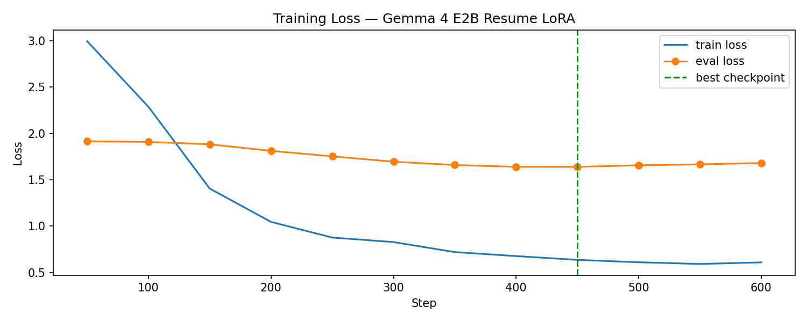
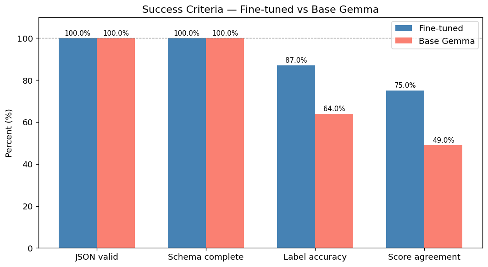
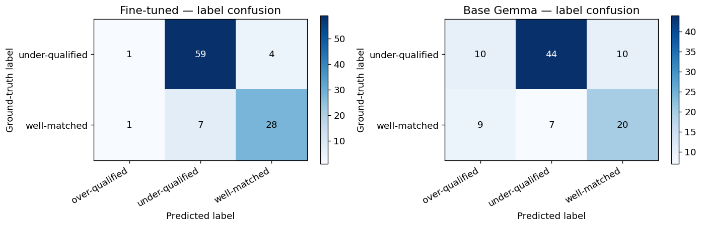
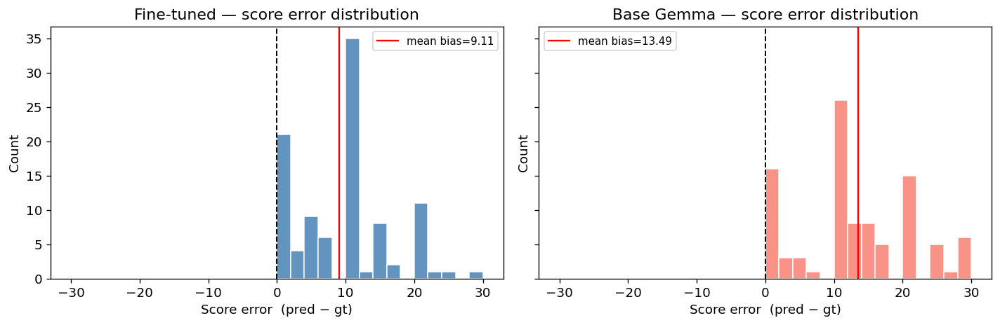

# Fine-Tuning a Local Language Model for Structured Resume-Job Fit Analysis

**Nicholas Fairhart**
University of Hawaii at Manoa
ICS 605 — Final Project Report

---

## Abstract

We present a resume-to-job fit analyzer that provides structured, actionable feedback across eight criteria using a fine-tuned 2-billion-parameter language model running entirely on consumer hardware. GPT-4-nano was used as a teacher model to label 10,000 resume-job pairs drawn from public datasets, and Google's Gemma 4 e2b was fine-tuned via LoRA to replicate that judgment at a fraction of the cost. Evaluation on 100 held-out validation examples shows fine-tuning improves match score agreement (within plus or minus 10 points of the teacher) from 49% to 75%, and experience level classification accuracy from 64% to 87%.

---

## 1. Introduction

Job searching is fundamentally a communication problem. A candidate may possess exactly the skills a role requires, yet fail to secure an interview because their resume does not speak the language of the job description. Recruiters, who often lack domain expertise and review hundreds of applications, cannot bridge that gap. This mismatch is particularly acute for career-returners: candidates with legitimate, transferable experience who must overcome both a resume presentation problem and the stigma of an employment gap.

This paper describes a system designed to address that problem directly. We present a resume-to-job fit analyzer that provides structured, actionable feedback across eight criteria (match score, skill gaps, ATS keyword coverage, and experience level fit) using a fine-tuned 2-billion-parameter language model that runs entirely on consumer hardware.

The core technical contribution is knowledge distillation via supervised fine-tuning: GPT-4-nano is used as a teacher model to label 10,000 resume-job pairs drawn from public datasets, then Google's Gemma 4 e2b is fine-tuned using LoRA adapters to replicate that judgment at a fraction of the cost. The model runs locally on an Apple M1 with 8GB RAM, with no API budget or cloud infrastructure required.

Evaluation on 100 held-out validation examples shows that fine-tuning improves match score agreement from 49% to 75%, and experience level classification accuracy from 64% to 87%.

---

## 2. Related Work

Prior to building this system, resume feedback was sought through general-purpose chat interfaces. These interactions tended to focus on isolated resume lines rather than the overall alignment between a candidate's profile and a specific job description, and without structured outputs the feedback was difficult to act on systematically.

Retrieval-augmented generation (Lewis et al., 2020) provided a foundation for connecting resumes to relevant job postings. By encoding both resumes and job descriptions as dense vector embeddings and retrieving candidates using cosine similarity, semantically similar documents could be paired before any language model evaluation occurred. This ensured the scoring model received well-matched inputs rather than arbitrary pairs.

To produce a local model capable of structured evaluation, we used GPT-4-nano as a teacher model to label 10,000 resume-job pairs with eight-criteria assessments, then fine-tuned Gemma 4 e2b on those outputs, which is knowledge distillation through imitation learning (Hinton et al., 2015). Fine-tuning used LoRA (Hu et al., 2022), which inserts small low-rank matrices into the model's attention layers while leaving original weights frozen. With rank r=8 applied to three attention modules, this introduced 3.7 million trainable parameters out of 5.1 billion total, as reported by the Unsloth training framework (Han & Han, 2023). Training completed in just over one hour on a Google Colab A100.

---

## 3. Data

Two publicly available Kaggle datasets formed the basis of this work. The resume dataset (Anbhawal, 2022) contains 2,483 resumes spanning 25 professional categories including healthcare, engineering, and finance. The job postings dataset (Kon, 2023) contains 123,849 LinkedIn job listings with structured fields for title, company, location, experience level, and full description text.

To generate training pairs, 100 resumes were sampled per job category across 24 categories, as one category was accidentally excluded during the query configuration stage. For each resume, ChromaDB was queried using OpenAI text-embedding-3-small embeddings to retrieve the three most semantically similar job postings. An additional two postings were selected at random per resume to introduce lower-quality matches and increase score variance across the training set. Pair generation was stopped at 10,000 total examples to maintain a fixed project budget.

Each pair was scored by GPT-4-nano using a structured output schema covering eight criteria: match score, experience level fit, matching strengths, skill gaps, ATS keyword coverage, resume improvements, and recommended activities. In total, nearly 17 million tokens were processed at a cost of approximately $4.68. Because the goal was to distill consistent scoring behavior into a smaller model rather than achieve ground truth labels, the consistency of the teacher model was prioritized over manual label verification. The final dataset was split into 9,000 training pairs and 997 validation pairs using a fixed random seed for reproducibility.

---

## 4. Method

Training data was formatted using the Gemma 4 instruction template, with the resume and job description concatenated into the user turn and the structured JSON response in the model turn. Loss was computed exclusively on the model response using Unsloth's train_on_responses_only masking. In early experiments the full prompt-response sequence was included in the loss, which caused the model to fit the instruction template rather than the scoring task; this corrects that.

LoRA adapters were applied to three attention projection modules (q_proj, v_proj, o_proj) with rank r=8 and alpha=16, introducing 3,735,552 trainable parameters out of 5,126,913,568 total (0.07%). Early experiments used seven target modules and a higher learning rate, which caused rapid overfitting. Reducing the module count, setting the learning rate to 1e-5, adding dropout of 0.1, and applying weight decay of 0.05 stabilized training. A cosine learning rate schedule with 100 warmup steps was used across three epochs with an effective batch size of 32.

*Figure 1. Training and validation loss over 600 steps. The best checkpoint (green dashed line) is restored automatically via early stopping at step 450.*

Training ran on a Google Colab A100 (40GB) in BF16 precision using the Unsloth framework, which reduced memory overhead and accelerated throughput. The median tokenized sequence length was 1,468 tokens against a 3,072-token budget, with no examples exceeding the limit. Early stopping with patience of 3 evaluation intervals was used to restore the best checkpoint automatically.

The trained LoRA adapter was merged with the base model weights and quantized to Q4_K_M GGUF format using llama.cpp, reducing the model from approximately 10GB in BF16 to roughly 3-4GB, within the memory budget of an Apple M1 with 8GB RAM. The quantized model is served locally via LM Studio, which exposes an OpenAI-compatible API endpoint that the Streamlit application calls directly.

---

## 5. Experiments and Results

Evaluation was conducted on 100 randomly sampled validation examples using a fixed random seed applied identically to both the fine-tuned model and the base Gemma 4 e2b model, ensuring direct comparability. Each resume-job pair was submitted to the model via LM Studio's local API endpoint using the same prompt template used during training. Predictions were parsed from the JSON response and compared against GPT-4-nano ground truth labels on two metrics: match score agreement within plus or minus 10 points, and experience level classification accuracy across three categories.

Results are summarized in Table 1 and Figure 2. Fine-tuning improved score agreement from 49% to 75% and classification accuracy from 64% to 87%, representing gains of 26 and 23 percentage points respectively. Mean absolute error on match score decreased from 13.49 to 9.11 points. Both models exhibited a consistent positive scoring bias: virtually no predictions fell below the ground truth score, and mean signed error equaled MAE for both models, indicating the models over-predict rather than under-predict across the board.

*Figure 2. All four evaluation metrics compared across fine-tuned and base models.*

**Table 1. Evaluation results on 100 held-out validation examples.**

| Metric | Base Gemma 4 e2b | Fine-tuned |
|---|---|---|
| Score agreement (±10 pts) | 49% | 75% |
| Experience level accuracy | 64% | 87% |
| Match score MAE | 13.49 | 9.11 |
| Over-qualified false positives | 19 | 2 |

**Table 2. Score error distribution across 100 validation examples.**

| Error range | Base Gemma 4 e2b | Fine-tuned |
|---|---|---|
| 0–5 points | 22 | 34 |
| 6–10 points | 27 | 41 |
| 11–20 points | 36 | 22 |
| 21+ points | 15 | 3 |

The most striking qualitative finding involves experience level classification. The base model predicted "over-qualified" for 19 of 100 examples in a sample where the ground truth contained zero over-qualified cases, suggesting the base model applies this label without reliable signal. Fine-tuning reduced these false over-qualified predictions to 2. The confusion matrices in Figure 3 illustrate this clearly.

*Figure 3. Experience level classification confusion matrices. The base model incorrectly predicts "over-qualified" 19 times; the fine-tuned model reduces this to 2.*

Score error distributions are shown in Figure 4. The fine-tuned model concentrates errors near zero while the base model produces a wider, flatter distribution extending to 30 points.

*Figure 4. Distribution of signed score error (predicted minus ground truth) for both models. Both models over-predict consistently; the fine-tuned model's errors are tighter (MAE 9.11) while the base model's are more dispersed (MAE 13.49).*

A persistent gap between training and validation loss suggests the model did not fully generalize. Likely contributing factors include label noise from the teacher model, the relatively modest dataset size of 9,000 examples for a nuanced structured prediction task, and a distributional mismatch from Q4_K_M quantization: the model was trained in BF16 but evaluated in 4-bit precision.

---

## 6. Conclusion

This project demonstrates that knowledge distillation through supervised fine-tuning can meaningfully transfer structured scoring behavior from a large API model to a small local one. Training Gemma 4 e2b to imitate GPT-4-nano's resume evaluation judgment required only 9,000 examples, roughly one hour of A100 compute, and under five dollars in API costs, yet produced a 26 percentage point improvement in score agreement and a 23 percentage point improvement in experience level classification over the base model.

The primary limiting factor was dataset size and composition. Across the course, the importance of data quantity was consistently emphasized, and this project confirmed it directly: the gap between training and validation loss suggests the model learned the task but did not fully generalize, and more diverse, carefully constructed training pairs would likely close that gap. A promising direction would be to construct the dataset in reverse: start from job descriptions and synthetically generate resumes at varying levels of fit, giving the model cleaner, more controlled signal to learn from.

The system works and runs on consumer hardware, which was a genuine engineering goal. However, a user relying on this tool for real job applications should understand its limitations. The fine-tuned Gemma model performs adequately, but for production use the same structured prompt and output schema would benefit significantly from a stronger backend model such as GPT-4-nano or beyond. The application architecture was designed with this in mind: the backend is configurable, so upgrading the model requires no changes to the interface.

Finally, this project covered the full fine-tuning pipeline from data generation through LoRA training, quantization, and local deployment. That experience applies directly to edge computing scenarios where model size and inference cost are real constraints, and is probably the most valuable takeaway.

### AI Tool Disclosure

Claude (Anthropic) was used throughout this project in two capacities. First, Claude Code served as a coding assistant in implementing the data pipeline, including resume and job posting extraction, ChromaDB embedding, GPT-4-nano scoring, training data preparation, and the Streamlit web application. Second, Claude was used as a writing assistant in drafting this report. The author described methodology, results, and interpretations across multiple conversations, and Claude helped organize and refine that language into coherent prose. All architectural decisions, training parameter choices, and analytical conclusions reflect the author's own understanding and judgment.

---

## References

Anbhawal, S. (2022). *Resume dataset* [Data set]. Kaggle. [https://www.kaggle.com/datasets/snehaanbhawal/resume-dataset](https://www.kaggle.com/datasets/snehaanbhawal/resume-dataset)

Gemma Team. (2024). *Gemma: Open models based on Gemini research and technology* (Technical Report). Google DeepMind. [https://arxiv.org/abs/2403.08295](https://arxiv.org/abs/2403.08295)

Grootendorst, M. (2025). *A visual guide to Gemma 4* [Blog post]. Substack. [https://newsletter.maartengrootendorst.com/p/a-visual-guide-to-gemma-4](https://newsletter.maartengrootendorst.com/p/a-visual-guide-to-gemma-4)

Han, D., & Han, M. (2023). *Unsloth* [Software]. GitHub. [https://github.com/unslothai/unsloth](https://github.com/unslothai/unsloth)

Hinton, G., Vinyals, O., & Dean, J. (2015). Distilling the knowledge in a neural network. *arXiv*. [https://arxiv.org/abs/1503.02531](https://arxiv.org/abs/1503.02531)

Hu, E., Shen, Y., Wallis, P., Allen-Zhu, Z., Li, Y., Wang, S., Wang, L., & Chen, W. (2022). LoRA: Low-rank adaptation of large language models. *International Conference on Learning Representations*. [https://arxiv.org/abs/2106.09685](https://arxiv.org/abs/2106.09685)

Kon, A. (2023). *LinkedIn job postings* [Data set]. Kaggle. [https://www.kaggle.com/datasets/arshkon/linkedin-job-postings](https://www.kaggle.com/datasets/arshkon/linkedin-job-postings)

Lewis, P., Perez, E., Piktus, A., Petroni, F., Rocktäschel, T., Wu, Y., ... & Kiela, D. (2020). Retrieval-augmented generation for knowledge-intensive NLP tasks. *Advances in Neural Information Processing Systems, 33*. [https://arxiv.org/abs/2005.11401](https://arxiv.org/abs/2005.11401)
